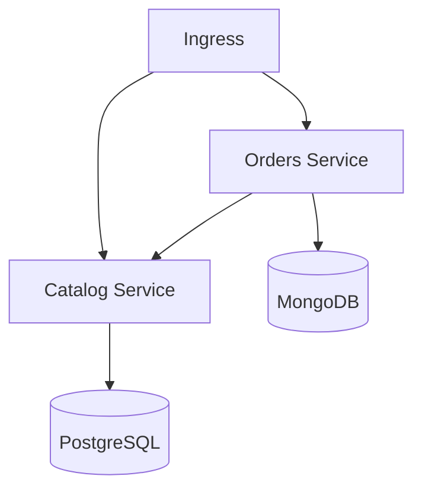

# BookBarn Microservices Application

A microservices-based book management system with catalog and order services.

## Architecture

The application consists of:

- **Catalog Service**: Manages books inventory (Python/FastAPI + PostgreSQL)
- **Orders Service**: Handles order processing (Python/FastAPI + MongoDB)
- **Helm Chart**: Kubernetes deployment configuration

### System Components



## Prerequisites

- Kubernetes cluster (e.g., Minikube)
- Helm 3.x
- kubectl configured
- Docker (for building images)

## Services

### Catalog Service
- Manages book inventory
- REST API on port 8000
- PostgreSQL backend
- Endpoints:
  - GET /health
  - GET /books
  - POST /books/{id}/reserve

### Orders Service
- Processes customer orders
- REST API on port 8001
- MongoDB backend
- Endpoints:
  - GET /health
  - POST /orders
  - GET /orders
  - GET /orders/{id}

## Deployment

1. **Add Local DNS Entry**
```bash
# Add to /etc/hosts
127.0.0.1 bookbarn.local
```

2. **Deploy Using Helm**
```bash
# Install
helm install bookbarn ./bookbarn-helm -n bookbarn --create-namespace

# Upgrade
helm upgrade bookbarn ./bookbarn-helm -n bookbarn
```

3. **Verify Deployment**
```bash
kubectl get all -n bookbarn
```

## Configuration

Key configurations in [values.yaml](bookbarn-helm/values.yaml):

```yaml
namespace: bookbarn
ingress:
  enabled: true
  host: bookbarn.local

catalog:
  image: bookbarn/catalog-service:1.0
  replicas: 1
  port: 8000

orders:
  image: bookbarn/orders-service:1.0
  replicas: 1
  port: 8001
```

## Testing Services

1. **Via Ingress**
```bash
curl http://bookbarn.local/catalog/health
curl http://bookbarn.local/orders/health
```

2. **Via Port Forward**
```bash
# Catalog Service
kubectl -n bookbarn port-forward svc/bookbarn-catalog 8000:8000

# Orders Service
kubectl -n bookbarn port-forward svc/bookbarn-orders 8001:8001
```

## Database Access

### PostgreSQL
- Database: catalogdb
- Persistent storage: 1Gi
- Credentials managed via Kubernetes secrets

### MongoDB
- Database: ordersdb
- Persistent storage: 1Gi
- Authentication enabled
- Credentials managed via Kubernetes secrets

## Troubleshooting

1. **Check Pod Status**
```bash
kubectl get pods -n bookbarn
```

2. **View Logs**
```bash
kubectl logs -n bookbarn deploy/bookbarn-catalog
kubectl logs -n bookbarn deploy/bookbarn-orders
```

3. **Check Services**
```bash
kubectl get svc -n bookbarn
```

## Cleanup

```bash
helm uninstall bookbarn -n bookbarn
kubectl delete namespace bookbarn
```